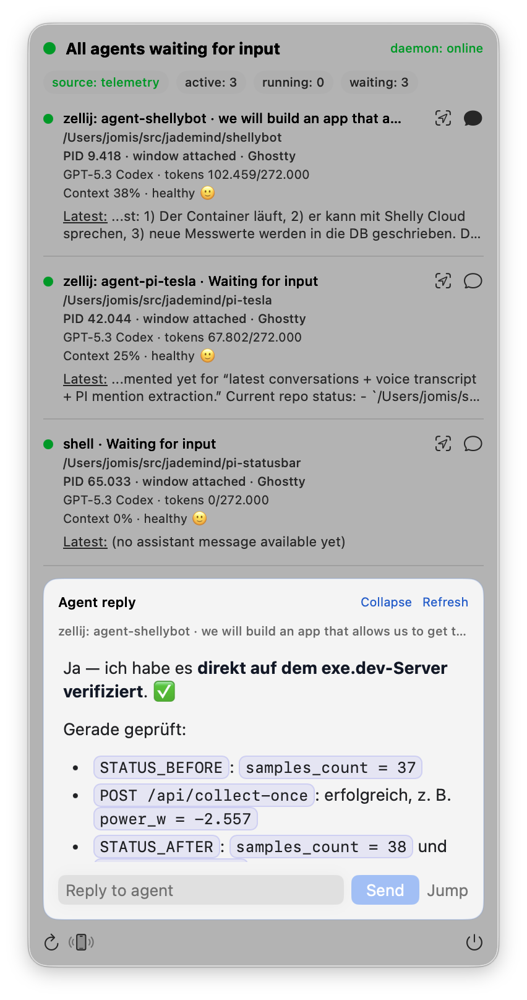

# Pi Status Bar

A **macOS status bar application for Pi** with a local daemon for process discovery, telemetry aggregation, and one-click session jump/focus.

This repository contains:

- **`pi-statusd`** (Python daemon): discovers Pi agents, merges telemetry, and handles jump/focus actions.
- **`PiStatusBar`** (SwiftUI app): menu bar UI that visualizes agent state and context pressure.

> `pi-statusbar` consumes telemetry from [`@jademind/pi-telemetry`](https://github.com/jademind/pi-telemetry) and reliable plain-session messaging from [`@jademind/pi-bridge`](https://github.com/jademind/pi-bridge). The iOS client is [PiPulse](https://pipulse.dev).

## Version

Latest tagged release: **0.1.15**

---

## Quick start (validated)

### Prerequisites

- macOS (menu bar app)
- Swift toolchain (`swift --version`)
- Python 3 (`python3 --version`)
- Pi installed (recommended for realistic testing)

### 1) Clone and enter repository

```bash
git clone https://github.com/jademind/pi-statusbar.git
cd pi-statusbar
```

### 2) Build the app

```bash
swift build
```

### 3) Start the daemon

```bash
daemon/pi-statusbar daemon-restart
daemon/pi-statusbar daemon-ensure
daemon/pi-statusbar daemon-status
daemon/pi-statusbar daemon-ping
```

Expected: `status` shows running daemon + healthy socket, and `ping` returns `{"ok": true, "pong": true, ...}`.

### 4) Run the status bar app

```bash
swift run PiStatusBar
```

The `π` icon should appear in the macOS menu bar.

### 5) (Optional, recommended) Enable telemetry source

```bash
pi install npm:@jademind/pi-telemetry
```

Then, in an active Pi session:

```bash
/pi-telemetry --data
```

If telemetry is active, the app should show `source: telemetry`.

### 6) (Optional, recommended) Enable bridge for reliable plain-terminal send

```bash
pi install npm:@jademind/pi-bridge
```

Then restart active Pi sessions and verify in each session:

```bash
/pi-bridge-status
```

### Managed startup (recommended)

Use the LaunchAgent management script for clean startup/login behavior:

```bash
daemon/pi-statusbar daemon-service-install
daemon/pi-statusbar daemon-service-start
daemon/pi-statusbar daemon-service-status
```

It verifies:

- plist is registered (`~/Library/LaunchAgents/dev.jademind.pi-statusd.plist`)
- service is loaded in `launchd`
- daemon socket health is OK

Useful commands:

```bash
daemon/pi-statusbar daemon-service-restart
daemon/pi-statusbar daemon-service-doctor
daemon/pi-statusbar daemon-service-uninstall
```

---

## Privacy and sensitive data

- This README avoids machine-specific absolute paths and credentials.
- Runtime data is stored locally under `~/.pi-statubar`.
- Do not commit local logs, telemetry dumps, or screenshots that expose private paths/session names.

## What it does

- Shows a live menu bar indicator of overall Pi agent state
- Lists active agents with:
  - mux/session + telemetry session name + activity
  - cwd path
  - pid + window attachment status (including detected terminal app)
  - model + token metrics (when telemetry is available)
  - context pressure line with clear health/mood signal
- Supports **Jump** to the correct terminal window/session
- Provides a dedicated **detail panel** for the selected agent with:
  - rich HTML/Markdown rendering of the latest assistant output
  - `Reply` text field (`Enter` sends immediately) + `Send` action
  - `Jump`, `Refresh`, and `Collapse` controls
- Falls back gracefully when telemetry is unavailable

### Latest UI (v0.1.15)

Telemetry discovery now prefers the canonical `~/.pi/agent/telemetry/instances` path (with backward-compatible fallback), restoring model metadata and latest assistant messages in the menu UI. `pi-statusbar status` continues to provide a formatted multi-section view (Daemon/App/HTTP), configurable HTTP ports via `--http-port`/`--https-port`, and `http-logs` streaming/export support.



### State colors

- **Red**: all agents running/working
- **Green**: all agents waiting for input
- **Yellow**: mixed states
- **White/neutral**: no agents

---

## Architecture

### 1) Daemon (`daemon/pi_statusd.py`)

- Unix socket: `~/.pi-statubar/statusd.sock`
- Commands:
  - `status`
  - `ping`
  - `jump <pid>`
  - `latest <pid>`
  - `send <pid> <message>` (delivery order: zellij/tmux → pi-bridge → tty/ui fallback)
  - `watch [timeout_ms] [fingerprint]`

### Optional HTTP bridge (for iOS / remote clients)

- iOS client: [PiPulse](https://pipulse.dev) uses this bridge to read status/watch updates and send messages to running Pi sessions.
- Script: `daemon/pi_statusd_http.py`
- Control via `daemon/pi-statusbar`:
  - `http-start`
  - `http-stop`
  - `http-restart`
  - `http-status`
  - `http-token [value]`
- Config file: `~/.pi-statubar/statusd-http.json`
- Exposed endpoints:
  - `GET /status`
  - `GET /watch?timeout_ms=...&fingerprint=...`
  - `GET /latest/<pid>`
  - `POST /send` with JSON body `{ "pid": <int>, "message": <string> }`
- Security defaults:
  - bearer token for non-loopback clients
  - optional CIDR allowlist (`allow_cidrs`)
  - `send` rate limiting and payload validation
  - `jump` is intentionally **not** exposed over HTTP
- Status payload version: `2`
- Source field values:
  - `pi-telemetry`
  - `process-fallback`

### 2) macOS status bar app (`Sources/PiStatusBar/*`)

- Polls daemon every 2 seconds
- Renders status chips:
  - source (`telemetry | fallback | offline`)
  - active/running/waiting counts
  - context pressure (`close to limit` / `at limit`)
- Shows attention banners for close-to-limit/at-limit context pressure

### Agent row layout

Each agent row is rendered as:

1. Primary line: mux/session + telemetry session name (when available) + activity
2. Workspace line: cwd path
3. Attachment line: `PID <pid> · window attached|no attached window · <terminal app>`
4. Model metrics line: model name/id + token usage (`used/contextWindow`) when telemetry provides it
5. Context line: context percent + classification (`healthy`, `close to limit`, `at limit`) with emoji indicator

When telemetry is unavailable, the row gracefully falls back to process-only metadata.

---

## Telemetry compatibility (latest `pi-telemetry`)

`pi-statusd` follows this data source strategy:

1. **Primary:** per-process telemetry files at:
   - `~/.pi-statubar/telemetry/instances/*.json`
2. **Optional fallback:** `pi-telemetry-snapshot`
3. **Final fallback:** process heuristics via `ps` + `lsof`

Compatibility notes:

- Supports telemetry activity mapping (`working`, `waiting_input`, fallback inference)
- Reads context metrics (`tokens`, `contextWindow`, `remainingTokens`, `percent`, `pressure`, `closeToLimit`, `nearLimit`)
- Reads model/session metadata for richer UI rows (`model.*`, `session.name`)
- Adds window attachment/app metadata in daemon responses (`attached_window`, `terminal_app`)
- Applies stale/alive filtering when reading telemetry files
- Defensively handles malformed telemetry entries

Install telemetry:

```bash
pi install npm:@jademind/pi-telemetry
```

---

## Jump behavior

When `jump <pid>` is requested, the daemon uses this order:

1. Focus attached mux client window
2. Fallback focus via Pi ancestry
3. Ghostty hint fallback (split pane support)
4. TTY/title fallback for iTerm2/Terminal
5. If no attached client exists, open terminal + attach/open shell
6. Never Finder fallback

Terminal preference config:

- Config file: `~/.pi-statubar/statusd.json`
- Env override: `PI_STATUS_TERMINAL`
- Values: `auto | Ghostty | iTerm2 | Terminal`
- Auto order: `Ghostty → iTerm2 → Terminal`

---

## Homebrew installation

A Homebrew formula is provided at `Formula/pi-statusbar.rb` (currently HEAD-capable).

### Install from local checkout

```bash
brew install --HEAD ./Formula/pi-statusbar.rb
```

This installs:

- `PiStatusBar` (menu bar app launcher; first run compiles with Swift locally)
- `pi-statusbar` (single unified CLI for daemon control, HTTP bridge, LaunchAgents, and setup flows)

### Start daemon via brew service (optional)

```bash
brew services start pi-statusbar
brew services list | rg pi-statusbar
```

Or use:

```bash
pi-statusbar daemon-service-start
pi-statusbar daemon-service-status
```

### Autostart menu bar app (optional)

```bash
pi-statusbar app-start
pi-statusbar app-status
```

To disable app autostart:

```bash
pi-statusbar app-uninstall
```

### Publish for other users (Homebrew tap)

To let anyone install with `brew install`, publish a dedicated tap repo:

1. Create repository: **`jademind/homebrew-tap`**
2. Add formula at: `Formula/pi-statusbar.rb`
3. Use stable `url` + `sha256` (recommended) for a tagged release tarball
4. Commit and push

Then users install with:

```bash
brew tap jademind/tap
brew install jademind/tap/pi-statusbar
```

Or one-line install:

```bash
brew install jademind/tap/pi-statusbar
```

If only `head` is defined in the formula, users install with:

```bash
brew install --HEAD jademind/tap/pi-statusbar
```

### Start after install (recommended)

One-command setup (start now + start at login):

```bash
pi-statusbar start
```

Start now only (no login autostart):

```bash
pi-statusbar start --login no
```

Verify:

```bash
pi-statusbar status
```

> Why not auto-start during `brew install`?
> Homebrew formulas should not silently start background services or register user LaunchAgents without explicit user consent. `pi-statusbar` keeps this explicit while minimizing setup friction.

### Stop / disable / remove

Stop now (keep login settings):

```bash
pi-statusbar stop
```

Stop now + remove login autostart:

```bash
pi-statusbar stop --remove yes
```

Remove package:

```bash
brew uninstall jademind/tap/pi-statusbar
```

---

## Build and run

### Start / restart daemon

```bash
daemon/pi-statusbar daemon-restart
```

### Verify daemon health

```bash
daemon/pi-statusbar daemon-status
daemon/pi-statusbar daemon-ping
```

### Run macOS status bar app

```bash
swift run PiStatusBar
```

### Refresh daemon + app together (recommended for local dev)

```bash
daemon/refresh-all.sh
```

Optional: also reinstall latest published bridge package before re-testing plain terminal delivery:

```bash
daemon/refresh-all.sh --bridge
```

### Build

```bash
swift build
```

---

## Control script

`daemon/pi-statusbar` is the single unified CLI.

Common commands:

- `start [--login yes|no]`
- `stop [--remove yes|no]`
- `remove`
- `status`

Daemon direct:

- `daemon-start`
- `daemon-stop`
- `daemon-restart`
- `daemon-ensure`
- `daemon-status`
- `daemon-ping`
- `daemon-latest <pid>`
- `daemon-send <pid> <message>`
- `daemon-watch [timeout_ms] [fingerprint]`
- `daemon-terminal [auto|Ghostty|iTerm2|Terminal]`

HTTP bridge:

- `http-start`
- `http-stop`
- `http-restart`
- `http-status`
- `http-token [value]`
- `http-cert-fingerprint`
- `http-ports`
- `http-logs [--follow] [--lines N] [--console | --file <path>]`
- Optional port overrides on relevant commands: `--http-port <port> --https-port <port>`

Service management:

- `daemon-service-install|start|stop|restart|status|doctor|uninstall`
- `app-install|start|stop|restart|status|uninstall`

`daemon/refresh-all.sh` supports:

- no args: restart daemon + app, then verify daemon health
- `--bridge`: same as above, plus `pi install npm:@jademind/pi-bridge`

---

## Operational guidance

- Keep daemon and app restarted after daemon/UI changes
- If UI shows fallback unexpectedly, verify active Pi sessions are emitting telemetry (`/pi-telemetry`)
- Socket is user-local (`0600` permissions)
- Detail HTML rendering uses a sandboxed `WKWebView` configuration:
  - content JavaScript disabled
  - non-persistent web data store
  - external navigation blocked (`about:` / `data:` only)
  - script tags and inline event handlers stripped before load
- Performance notes:
  - daemon status polling runs every 2s
  - selected detail panel refreshes incrementally using `latest_message_at`
  - latest message text/html are cached per PID in the UI

---

## Troubleshooting

### App shows `daemon: offline`

```bash
daemon/pi-statusbar daemon-restart
daemon/pi-statusbar daemon-status
```

If status is unhealthy, inspect `~/.pi-statubar/statusd.log`.

### Source chip stays on `fallback`

- Confirm telemetry is installed: `pi install npm:@jademind/pi-telemetry`
- In an active Pi session run: `/pi-telemetry --data`
- Ensure telemetry files exist under `~/.pi-statubar/telemetry/instances`

### Row shows `shell` without session name

- This is expected in process-fallback mode (no telemetry session metadata)
- With telemetry enabled, `session.name` is shown in the row primary line

### Jump does not focus expected window

- Ensure Accessibility permissions are granted for terminal apps and automation
- If using Ghostty split panes, keep session hints in titles/session names
- Verify terminal preference via:

```bash
daemon/pi-statusbar daemon-terminal
daemon/pi-statusbar daemon-terminal Ghostty
```

---

## OSS best practices

- Use scoped packages in docs and scripts: `@jademind/*`.
- Keep security defaults on (local socket perms, token auth for HTTP bridge, no HTTP jump endpoint).
- Prefer reproducible release flow:
  1. tag `pi-statusbar` release
  2. update `Formula/pi-statusbar.rb` (`url`, `sha256`, `version`)
  3. update `jademind/homebrew-tap`
  4. verify `brew install` + `brew services` + `pi-statusbar app-status`
- Include clear migration notes when changing package names, command behavior, or service startup logic.

---

## License

MIT — see [LICENSE](./LICENSE).
